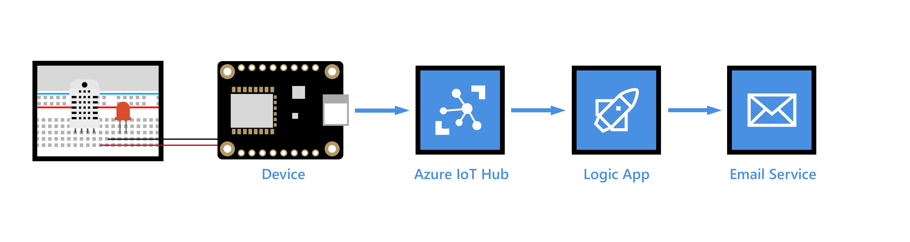

# Send Email For High Temperatures using Azure IoT Hub

Read temperature and humidity values from DHT 11 sensor by interfacing it with Raspberry Pi and send the data to Azure IoT hub. Configure IoT hub to send an email using Logic App.

## Running the Python Code on Raspberry Pi

### Prerequisites
- Create [IoT Hub](https://youtu.be/dMa-gjzV-3M) and [IoT Hub Device](https://youtu.be/7kJom1CDaYs) in Azure. Follow the steps on Youtube if not created.

- Python 3: Raspberry Pi typically comes with Python pre-installed, but you can ensure you have Python 3 installed by running the following command in the terminal:

    ```
    python3 --version
    ```

    If it's not installed, you can install it by running:

    ```
    sudo apt update
    sudo apt install python3
    ```

### Step 1: Install the Required Packages

- Open a terminal on your Raspberry Pi.

- Run the following command to install the necessary packages:

    ```
    pip3 install azure-iot-device asyncio
    ```
- Download the DHT library for Raspberry Pi, then extract it from the root folder and run the following command to install it.
    ```
    wget https://github.com/adafruit/Adafruit_Python_DHT/archive/master.zip
    unzip master.zip
    cd Adafruit_Python_DHT-master/
    sudo python3 setup.py install
    ```
    
### Step 2: Components required
- Raspberry Pi 3B (We can also use any other models of Pi)
- Micro SD Card-16 GB
- DHT11 Sensor
- Jumper wires
- Breadboard (if needed)
- 4.7K ohm resistor (if using 4 pin DHT11)
- Micro USB 5V, 2.4A Power supply

### Step 3: Hardware schematic
- Three pin DHT11


- Four pin DHT11


### Step 4 Workflow of the Project



### Step 5: Save the Code

- Create a new file on your Raspberry Pi and save the provided Python code into that file, for example, `send_DHT11_AzureIoT_Pi.py`.

### Step 6: Obtain the Device Connection String

- Replace `<your_device_connection_string>` in the code with the actual connection string for your Azure IoT Hub device. You can find the connection string in the Azure portal under your IoT Hub's "Shared access policies" section.

### Step 7: Azure Setup steps

Refer to the [Youtube tutorial]() for all the steps mentioned here

- Create a Service Bus namespace
- Add a Service Bus queue to the namespace
- Add a custom endpoint and routing rule to your IoT hub
- Create and configure a Logic App
- Configure the logic app trigger
- Configure the logic app action
- Test the logic app

### Step 8: Run the Code

- Open a terminal on your Raspberry Pi.

- Navigate to the directory where you saved the Python file.
- Before running the code, You should use the Azure IoT Explorer to monitor the data received at the IoT Hub.
- To configure the Azure IoT Explorer, look into the steps mentioned [here](https://github.com/Azure/azure-iot-explorer)
- Run the following command to start running the Python code:

    ```
    python3 send_DHT11_AzureIoT_Pi.py
    ```

- The code will now send DHT11 values to your Azure IoT Hub device. You should also see the message being printed on the Raspberry Pi console.
- The message with the property 'temperatureAlert= true' will reach the Service bus and the remaining messages will reach to default endpoint.
- The Logic App will be triggered when messages reach the Service bus and the Action of sending an email will be done.

